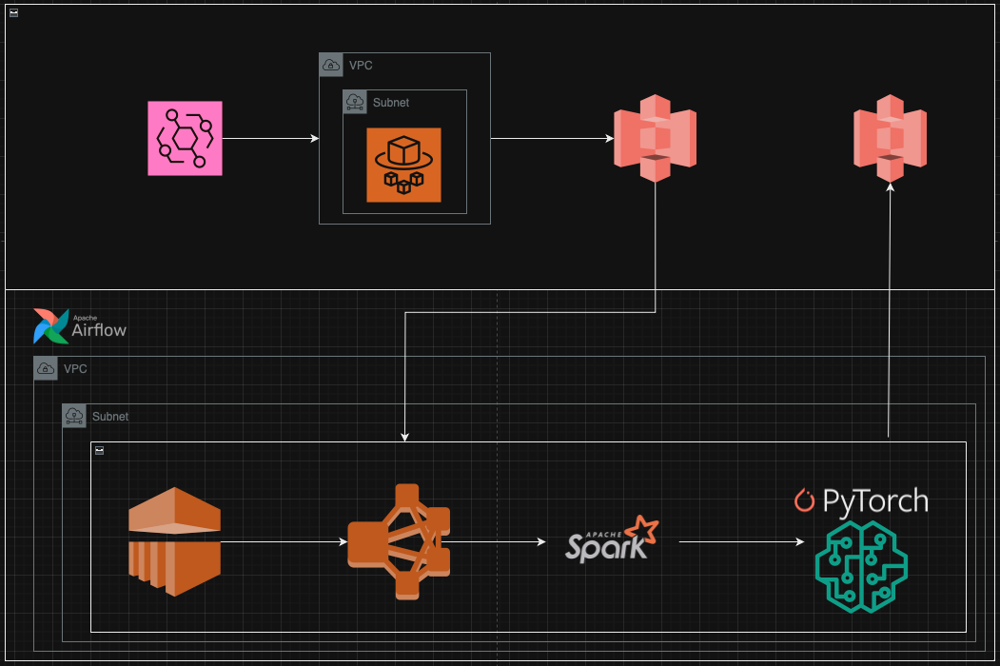

# Book2Flash: EPUB and PDF Text Extractor with NLP to create flashcards

## Overview

The goal of this package is the efficient conversion of text into educational flashcards. It streamlines the process of transforming digital books and documents into plain text. The module prepares data for NLP tasks and optimizes language models for enhanced performance. It uses AWS Elastic MapReduce (EMR) for time-efficient model training.





## Features

### Text Extraction

- **File Conversion**: Automatically detects the input file type (EPUB or PDF) and performs text extraction accordingly. The process includes measuring and reporting the file processing time.
    - **EPUB Text Extraction**: Utilizes BeautifulSoup to parse and extract clean text from EPUB files, preserving textual content without HTML tags. Metadata such as the book's title and author are also displayed if available.
    - **PDF Text Extraction**: Employs the PyMuPDF library to read and concatenate text from each page of PDF documents into a single string, ensuring comprehensive text retrieval.
- **Text Saving**: Implements a method to save extracted text into a specified file, formatting the content by placing each sentence on a new line to enhance model training.


### Text Augmentation and Tokenization
- **NLTK Synonyms Extraction**: Fetches synonyms for words using NLTK's WordNet, aiding in the augmentation process by providing alternative word choices.
- **Text Augmentation**: Replaces words in sentences with their synonyms to introduce variability into the dataset, which helps in model generalization.
- **Tokenization**: Applies the DistilBertTokenizer to augmented datasets, converting text into a suitable format for model input, including necessary padding and truncation.

### Model Training and Optimization
- **Model Training with Optuna**: Defines an optimization function for hyperparameter tuning with Optuna, focusing on minimizing evaluation loss. The process includes initializing a DistilBertForMaskedLM model, adjusting token embeddings, setting up training arguments, and saving the best-performing model.
- **Special Token Handling**: Adds custom tokens (e.g., "CUDA", "GPU", "CPU", "DQP") to the tokenizer, allowing the model to treat these tokens as single entities.

### Integration with Cloud Services
- **Infrastructure as Code (IaC) with Terraform**: In further development, this package will utilize IaC defined in Terraform to leverage AWS Elastic MapReduce (EMR) for model training at scale.
- **Data Storage with Amazon S3**: Amazon S3 will be used for storing both raw and processed data, ensuring scalability and accessibility of data for training and evaluation processes.

## Usage

1. **Text Extraction and Saving**: Run the script and provide paths to your EPUB or PDF files and the desired output text file location. The script extracts text, formats it, and saves it to the specified output file.

```bash
poetry run python /scraper/main.py
```

2. **Model Training and Optimization**: The package includes functionality for data augmentation and model training. Customize the augmentation rate, tokenization parameters, and model training arguments as needed. Use Optuna for hyperparameter optimization to enhance model performance.

Train (align file paths):
```bash
poetry run python /pyspark/main.py
```

Evaluate (update test sentences):
```bash
poetry run python /pyspark/main2.py
```

## Requirements

- poetry
- BeautifulSoup
- ebooklib
- PyMuPDF (fitz)
- NLTK
- transformers
- datasets
- Optuna
- PySpark (for handling large-scale data processing)
- Terraform (for deploying infrastructure on AWS)
